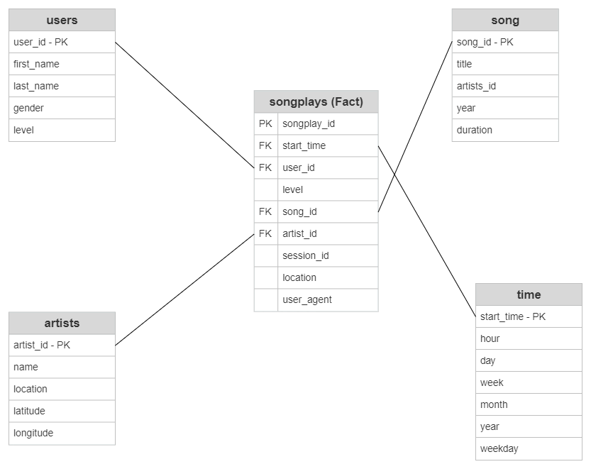

# Project: Data Modeling with Postgres
A startup called Sparkify wants to analyze the data they've been collecting on songs and user activity on their new music streaming app. The analytics team is particularly interested in understanding what songs users are listening to. Currently, they don't have an easy way to query their data, which resides in a directory of JSON logs on user activity on the app, as well as a directory with JSON metadata on the songs in their app.

The project aims to create a Postgres database with tables designed to optimize queries on song play analysis. The task is to create a database schema and ETL for this analysis which can be tested by running queries given to you by the analytics team from Sparkify and compare your results with their expected results.

At the end, the project sucessfully performs data modeling with Postgres and build an ETL pipeline using Python. In detail, fact and dimiension tables for a star schema are defined for a particular analytic focus, and an ETL pipeline that transfers data from files in two local directories into these tables in Postgres was built using Python and SQL.



### Project Structure

  * `data/` -- Dataset.

  *  `test.ipynb` displays the first few rows of each table to let you check your database.
  
  * `create_tables.py` drops and creates your tables. You run this file to reset your tables before each time you run your ETL scripts.
  
  * `etl.ipynb` reads and processes a single file from the data and loads the data into your tables. This notebook contains detailed instructions on the ETL process for each of the tables.
  
  * `etl.py` -- A python script reads and processes files from the data and loads the data into your tables.
  
  * `sql-queries.py` contains all your sql queries, and is imported into the last three files above.
  
### Running the program
Step 1: Clone the project from repo
```bash
git clone git@github.com:phihd/data-modeling-postgreSQL.git
```
Step 2: Run the program
```bash
cd data-modeling-posgreSQL
python create_tables.py
python etl.ipynb
```
